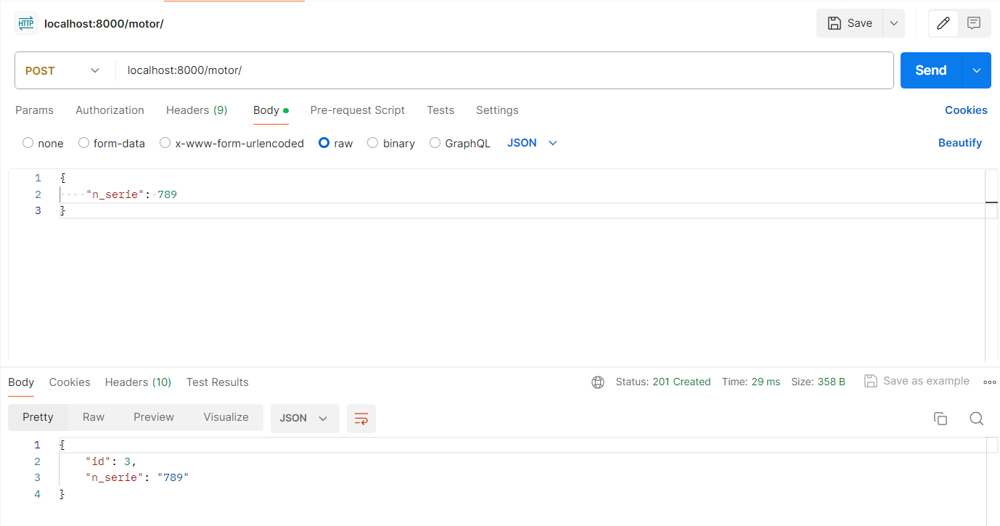

# Base project

- [Base project](#base-project)
  - [Installation](#instlalation)
    - [Creation of the project:](#creation-of-the-project)
    - [Part with Django:](#part-with-django)
  - [Endpoints](#endpoints)

## Installation

* Install [Docker](https://docs.docker.com/engine/install/).
* Install [Docker Compose](https://docs.docker.com/compose/install/)
* Clone this repo and execute this code:
```
docker-compose build
docker-compose up
```

Ready!

This project contains the dockers of the Database and the API. You need to add a third container in the archive `docker-compose-yaml` with the configurations that you want to use for the Views.

Next is a short explication of the steps done during the creation of this project.

### Creation of the project:
* Create the virtual environment `python3 -m venv venv`.

We install the module `venv` (first argument) in the folder created `venv` (last argument).

* Activate the virtual environment `source venv/bin/activate`

So that every `pip install ...` install the packages in this environment.

### Part with Django:
- Creation of some models, in this case the 
**Motor** entity with its atribute *serial_number*. 

- Migration of the database with the following commands:
```
python manage.py makemigrations
python manage.py migrate
```

- Creation of the _serializer_, a Django component that allows to transform and manage different model types.

- Creation of the business logic. The mother class `ModelViewSet` allows to inherit the CRUD actions needed for the project.


## Endpoints

Once the containers are up, you can use [Postman](https://www.postman.com) or another similar tool to test the endpoints.

In the base project the following have been implemented:
```
GET: localhost:8000/motor/
POST: localhost:8000/motor/
PUT: localhost:8000/motor/{id_motor}/
DELETE: localhost:8000/motor/{id_motor}/
```
Example:

